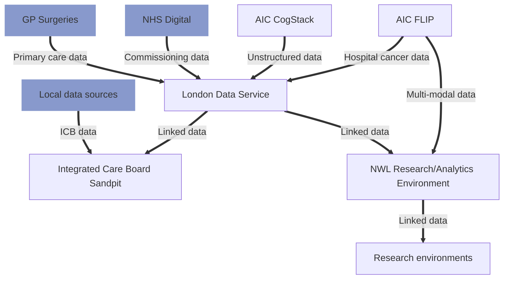

# Introduction

```mermaid
flowchart TD
    A[GP Surgeries] ==>|Primary care data| B[London Data Service]
    Ab[NHS Digital] ==>|Commissioning data| B
    Ac[Local data sources] ==>|ICB data| E
    Ad[AIC CogStack] ==>|Unstructured data| B
    B ==>|Linked data| C[NWL Research/Analytics Environment]
    Ae[AIC FLIP] ==> |Multi-modal data| C
    Ae[AIC FLIP] ==> |Hospital cancer data| B
    B ==>|Linked data| E[Integrated Care Board Sandpit]
    C ==>|Linked data| F[Research environments]

    classDef blue fill:#89c, stroke-width:0px
    class A,Ab,Ac blue
```
